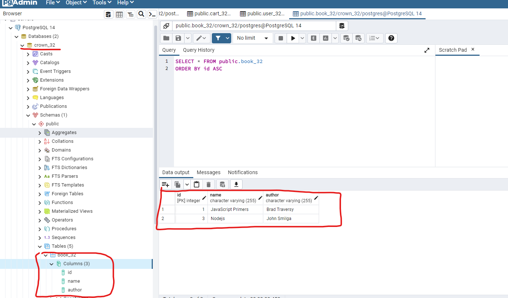
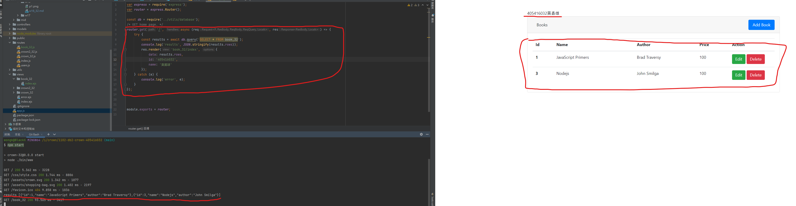
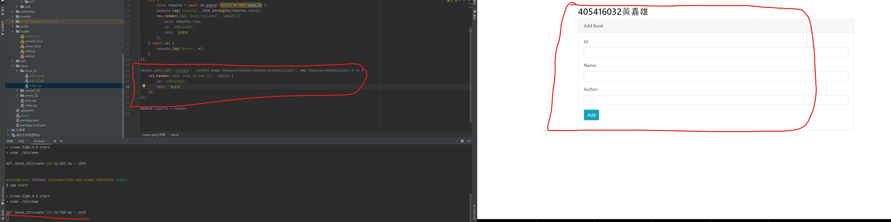
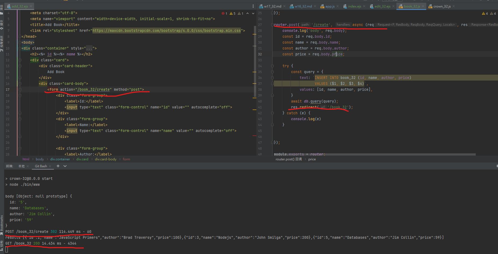
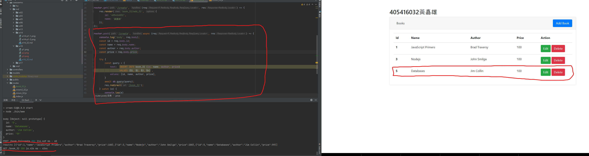

### w16-p1: create book_xx in postgreSQL server, enter two data



### w16-p2: get all data from table book_xx



### w16-p3: /book_xx/create to book_xx/add_xx.ejs



### w16-p4: POST /book_xx/create to create a book data





```
$ git log --pretty=format:"%h%x09%an%x09%ad%x09%s" --after="2022-06-06"                                                                                                                                                                 
91f0a66 roberttt456     Thu Jun 16 20:19:22 2022 +0800  w16 p2~p4
8d807b2 roberttt456     Thu Jun 16 19:27:34 2022 +0800  w16
8474e4d roberttt456     Thu Jun 16 19:26:41 2022 +0800  w17

```