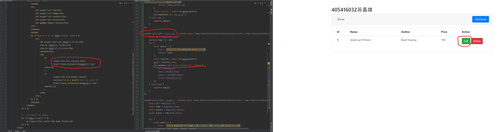

##  Github repo URL
```https://github.com/roberttt456/1102-db2-crown-405416032```


### w17-p1: create user_xx in postgreSQL server, enter two data, the first one is about your


### w17-p2: create cart_xx in postgreSQL server, enter five data, one for each category


### w17-p3: give query to get related data for cart info shown in ejs


### w17-p4: insert data in order to violate the key constraints, foreign key constraints


### w17-p5.1: test ON UPDATE CASCASE


### w17-p5.2: test ON DELETE SET NULL


### w17-p6: implement /book_xx/delete/:id


### w17-p7: implement /book_xx/update




```
$ git log --pretty=format:"%h%x09%an%x09%ad%x09%s" --after="2022-06-06"         
9ac51ef roberttt456     Thu Jun 16 20:20:59 2022 +0800  w16 p2~p4
91f0a66 roberttt456     Thu Jun 16 20:19:22 2022 +0800  w16 p2~p4
8d807b2 roberttt456     Thu Jun 16 19:27:34 2022 +0800  w16
8474e4d roberttt456     Thu Jun 16 19:26:41 2022 +0800  w17
```